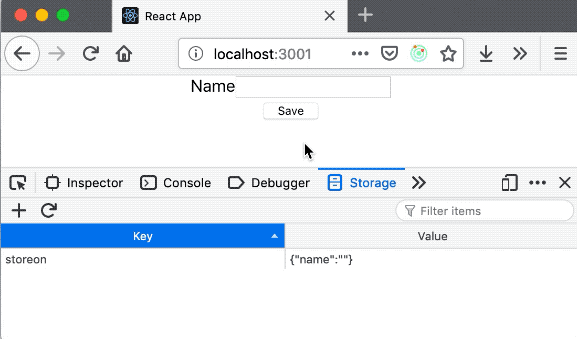

# Storeon localStorage


Tiny module for [Storeon] to store and sync state to `localStorage`. It restores state from `localStorage` during page loading and saves state on every change.

It is just 269 bytes module (it uses [Size Limit] to control the size) without any dependencies.

[Size Limit]: https://github.com/ai/size-limit
[Storeon]: https://github.com/storeon/storeon

## Installation

```
npm install @storeon/localstorage
```

If you need to support IE, you need to [compile `node_modules`] with Babel.

[compile `node_modules`]: https://developer.epages.com/blog/coding/how-to-transpile-node-modules-with-babel-and-webpack-in-a-monorepo/

## Usage

If you want to store and sync state to `localStorage` you should import the `persistState` from `@storeon/localstorage` and add this module to `createStoreon`.

```js
import { createStoreon } from 'storeon'
import { persistState } from '@storeon/localstorage'

let name = store => {
  store.on('@init', () => ({ name: '' }))

  store.on('save', (state, name) => ({ name: name }))
}

const store = createStoreon([
  name,
  persistState(['name'])
])
```

Here you can see that the form ask user the name and after that show this name.

```js
import { StoreContext, useStoreon } = require('storeon/react')

const Form = () => {
  const { dispatch, name } = useStoreon('name')

  return (
    <React.Fragment>
      {name !== '' && <h3>Hello {name}!</h3>}
      {name === '' &&
        <div>
          <label>Name</label>
          <input type="text" id="name" />
          <br/>
          <button onClick={
            () => dispatch('save', document.getElementById('name').value)
          }>Save</button>
        </div>
      }
    </React.Fragment>
  )
}
```

Event after refresh the page the state is updating from `localStorage`. And user see the greeting message.



### persistState(paths, config)

#### paths parameter

```js
type paths = Void | Array<String> | Array<RegExp>
```

If no value is provided to `paths`, then `persistState` stores all state in local storage.

#### config parameter

```js
type config.key = String
```

Default value of `config.key` is `storeon`. This key is using to store data in local storage.

```js
type config.storage = Storage
```

Set `config.storage` with `sessionStorage` or other `Storage` implementation to change storage target. Otherwise `localStorage` is used (default).

## LICENSE

MIT

## Acknowledgments

This module based on [redux-localstorage](https://github.com/elgerlambert/redux-localstorage).
